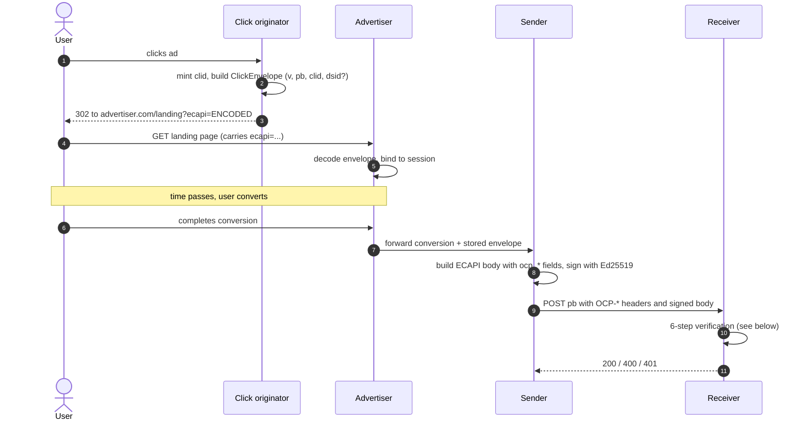
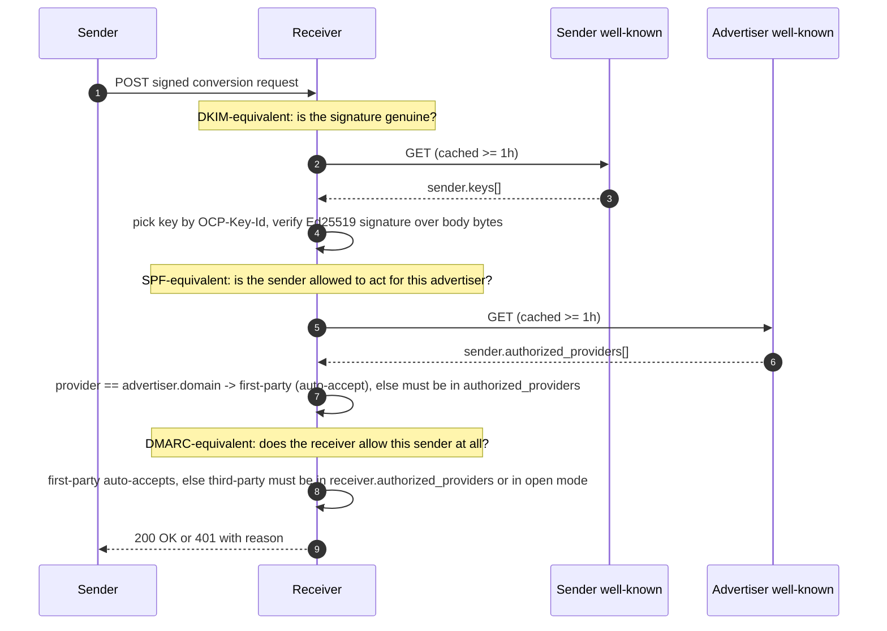
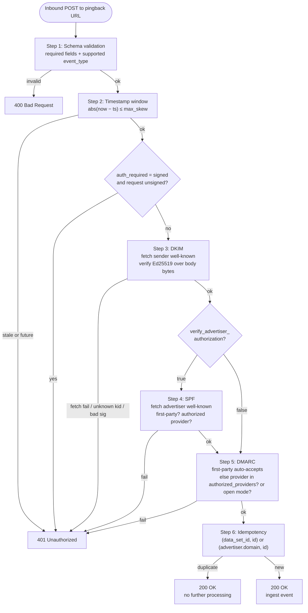

# Open Conversion Pingback (OCP)

**Draft spec, v0.1**
**Author:** Amir Rad
**Status:** Working draft, not for implementation

-----

## Problem

Walled gardens (Google, Meta, TikTok, Snap) operate Conversion APIs (CAPI) that let advertisers send post-click conversion events back to the platforms that originated their clicks. They use that signal to optimize targeting algorithms, ad delivery, build lookalikes, and improve UX. The advertiser gets lower CPAs, the platform gets better signal, the user gets more relevant ads.

The open web has no equivalent. There is no standard way for an advertiser's conversion data to flow back to the publisher (or any other open-web destination) that originated the click. Yield optimization, audience products, and inventory pricing across the open web are flying blind on the metric that matters most to advertisers.

The result: walled gardens compound their data advantage, the open web loses share, and the ecosystem becomes more concentrated every year.

## Goal

Define an open, vendor-neutral protocol that lets *any* conversion-event destination on the open wire (publishers, walled gardens, ad networks, affiliate networks, anyone receiving conversion signal) accept events using the same envelope, the same authentication model, and the same discovery primitives. Any sender (advertiser running their own CAPI, or a third-party CAPI provider) can implement it. Any destination can receive it. No single vendor controls the standard.

OCP is positioned as a **destination profile of [IAB Tech Lab's ECAPI 1.0](https://github.com/InteractiveAdvertisingBureau/ecapi)**: the recipient-side counterpart to ECAPI's payload standardization. Walled gardens that adopt OCP gain a multi-vendor open alternative to their proprietary `gclid`/`fbclid`/`ttclid` parameters, with no loss of capability and no gatekeeping. The protocol is destination-agnostic by design.

-----

## Relationship to existing work

### IAB Tech Lab ECAPI

[ECAPI 1.0](https://github.com/InteractiveAdvertisingBureau/ecapi) (released January 2026) standardizes the payload format for server-to-server conversion events from advertisers to "advertising platforms and partners." It defines 28 standard event types, a hashed-PII `user_data` block, GPP consent strings, and a structured `properties` envelope.

ECAPI explicitly defers endpoint discovery and authentication to "partner specific" arrangements. OCP fills exactly that gap. The OCP wire payload **is** an ECAPI 1.0 event payload with three additional fields. The novel parts of OCP are:

- A click-time mechanism for telling the advertiser where to send the conversion (encoded URL parameter)
- A federated authentication model based on sender-published public keys (DKIM-style), advertiser-published authorized-sender lists (SPF-style), and destination-published policy declarations (DMARC-style)
- A unified well-known file format for every participating entity to declare its role and configuration

The long-term goal is to upstream OCP into ECAPI as the standard destination profile.

### Privacy Sandbox Attribution Reporting API and Private Click Measurement

Browser-native, aggregation-only attribution measurement. ARA (Chrome) and PCM (Safari/WebKit) provide privacy-preserving conversion reports without third-party cookies, but with severe bandwidth limits, fixed report schedules, and no support for first-party advertiser data enrichment. OCP is **complementary**, not competing. Where the advertiser has consented first-party data, OCP provides a deterministic server-side path that ARA/PCM aggregation cannot match.

### Vendor-specific publisher CAPIs

Affiliate networks (Tradedoubler, Partnerize, Awin) and some SSPs (Microsoft Xandr's "Advertiser Attributed Conversions") have proprietary publisher-side conversion APIs. These work but are per-network and closed. OCP is the open multi-destination equivalent.

### Walled-garden CAPIs

Google, Meta, TikTok, Snap each operate proprietary CAPIs. OCP can serve as a public-protocol substitute or complement: a walled garden could accept OCP events alongside its own API surface, gaining a vendor-neutral integration path without giving up its existing tooling.

-----

## Design principles

1. **Open and royalty-free.** Implementable by anyone without licensing or registration.
1. **Destination-agnostic.** Works for publishers, walled gardens, ad networks, affiliate networks, and any other entity receiving conversion events.
1. **Federated trust.** No central registry. Every entity hosts its own well-known file declaring its role and policies; verification is direct between sender and destination.
1. **Privacy-first defaults.** Aggregated by default, granular only with explicit consent and a documented legal basis.
1. **Minimal advertiser burden.** Advertisers already firing ECAPI to walled gardens add an OCP destination with config, not engineering.
1. **Self-contained click envelope.** All routing information travels with the click. No registry lookups required to fire a conversion.
1. **Cryptographic authentication, not bearer tokens.** Senders prove origin with signatures, not pre-shared secrets that can leak.

-----

## Architecture overview

### Roles

Four roles participate, though a single entity can play more than one:

| Role | What it does | Who typically plays it |
|---|---|---|
| **Click originator** | Mints the click ID, builds the envelope, redirects the user to the advertiser. | Publisher, ad network or SSP, walled garden |
| **Advertiser** | Hosts the landing page, captures the envelope on landing, fires conversions. | The brand running the campaign |
| **Sender** | Builds the signed conversion request. May be the advertiser itself (first-party CAPI) or a third party acting on the advertiser's behalf. | Third-party CAPI provider, advertiser's own server |
| **Receiver** | Receives signed conversion requests at the pingback URL, verifies them, ingests events. | Publisher, ad network or SSP, walled garden (usually the same entity as the click originator) |

In the canonical case the click originator and the receiver are the same entity (a publisher minting a click ID and later receiving conversions for it), but the protocol does not require that.

### Primitives

OCP defines three primitives:

1. **The click envelope.** An encoded parameter on every click URL carrying everything needed to fire a conversion: pingback URL, click ID, optional dataset ID.
2. **The conversion request.** An HTTP POST of an ECAPI-compatible payload to the pingback URL, signed by the sender.
3. **The well-known file** (`/.well-known/ocp.json`). Published by every participating entity, declaring the entity's role (sender, receiver, or both) and the configuration for that role.

### End-to-end flow



### Federated trust model

Authentication uses three independent checks modeled on email's SPF + DKIM + DMARC. None of the three depend on a central registry; each is satisfied by an HTTPS GET of a well-known file under a domain the relying party already trusts to identify itself.

| Email auth | OCP equivalent | What it proves | Where the data lives |
|---|---|---|---|
| **DKIM** | Sender signs request; receiver verifies via sender's published public keys | The sender is who they claim to be | `sender.keys` in `https://{sender}/.well-known/ocp.json` |
| **SPF** | Advertiser declares which CAPI providers may send on its behalf; receiver verifies | The sender is *authorized* to send for the named advertiser | `sender.authorized_providers` in `https://{advertiser}/.well-known/ocp.json` |
| **DMARC** | Receiver's well-known file declares its auth policy; senders and advertisers consult it before integrating | Receiver's enforcement posture is discoverable up front | `receiver.*` in `https://{receiver}/.well-known/ocp.json` |



-----

## The click envelope

When a publisher (or any other click originator) constructs the landing-page URL for a click, it appends a single `ecapi` query parameter containing a base64url-encoded JSON object:

```
https://advertiser.com/landing?ecapi=eyJ2IjoiMC4xIiwicGIiOiJodHRwczovL3JlZGRpdC5jb20vcGIvY29udmVydCIsImNsaWQiOiJhYmMxMjMiLCJkc2lkIjoicmVkZGl0LXRlbmFudC00MiJ9
```

Decoded:

```json
{
  "v": "0.1",
  "pb": "https://reddit.com/pb/convert",
  "clid": "abc123",
  "dsid": "reddit-tenant-42"
}
```

### Envelope fields

| Field | Type | Required | Description |
|---|---|---|---|
| `v` | string | yes | OCP spec version. Currently `"0.1"`. |
| `pb` | string | yes | Pingback URL: the destination's HTTPS endpoint that will receive the conversion event. Must be HTTPS. |
| `clid` | string | yes | Click ID minted by the destination. Opaque to the advertiser. Max 256 characters. |
| `dsid` | string | no | Dataset ID. Identifies a specific advertiser account or sub-account on the receiving side. Optional but recommended where the destination operates per-advertiser onboarding (e.g. major publishers). |

### Encoding

The envelope is JSON, encoded with URL-safe base64 (RFC 4648 §5, no padding). Keys are abbreviated to minimize URL length.

The advertiser's site captures the `ecapi` parameter on landing, decodes it, and stores the decoded object against the user's session. The session storage requirement is the same one ECAPI implementers already handle for `gclid`, `fbclid`, and similar: bind the click identifier to the session, retrieve it at conversion time, fire the CAPI event.

### Survivability

The encoded envelope is a single atomic parameter. URL-hygiene tools that strip unrecognized parameters on landing will strip `ecapi` along with `gclid` / `fbclid` / `utm_*` / etc.; tools that preserve a known-tracking allowlist need only add a single rule (`preserve ?ecapi=…`) to be OCP-aware. The protocol does not depend on novel browser behavior. Anything that lets `gclid` survive will let `ecapi` survive.

If the envelope is stripped before the advertiser captures it, the conversion is unattributable from OCP's perspective and the advertiser falls back to whatever it would have done without OCP.

### Advertiser-side capture: out of scope

What an advertiser does between landing-time decode and conversion-time firing (storage of one or more captured envelopes, attribution model, propagation across pages and sessions, the conversion-event trigger itself) is **implementation-defined** and out of scope for this spec. It is the same problem that `gclid`, `fbclid`, `ttclid`, and every other click-tracking parameter ecosystem has solved for over a decade, with established patterns: server-set first-party cookies, JS pixels backed by a first-party CNAME with HttpOnly cookies, edge functions on modern hosting platforms, dedicated CAPI vendors. Advertisers may build it themselves or delegate to an ad-tech provider; that's where vendors compete on signal quality, durability, dedup, fraud filtering, and ITP resilience. The protocol does not constrain the choice, and protocol compliance does not depend on the storage mechanism. The wire format begins again at the signed conversion request.

### Click-originator side: out of scope

Symmetrically, *minting* the click ID, *constructing* the envelope, *attaching* it to advertiser landing URLs, and collecting whatever click-side context the originator needs for its own attribution, reporting, optimization, audience products, or downstream fan-out is **implementation-defined** and out of scope. Click originators (publishers running their own ad servers, SSPs and ad networks operating tracker URLs, ad-tech vendors offering click-tracking-as-a-service) are free to choose any clid format with sufficient entropy, any page-context join strategy (ad-server macros, postMessage from creative, server-side impression pixels), any attribution store, and any internal propagation to publisher analytics, GAM, GA4, DSPs, or data warehouses. The protocol's only requirements are that the `pb` URL in the envelope resolves to a receiver under the originator's domain, that the originator recognizes a `clid` it minted when a conversion arrives, and that the receiver runs the verification flow correctly. How the clid is generated, what page-side data is captured, and how that data flows to the rest of the originator's stack is vendor territory and a competitive surface.

-----

## The conversion request

When the advertiser's CAPI implementation fires a conversion, it POSTs to the `pb` URL from the stored envelope. The body is an ECAPI 1.0 event payload with three OCP-specific top-level fields and a required `advertiser` object; the headers carry the OCP-specific provenance and signature data the receiver needs to verify it.

### HTTP request

```http
POST /pb/convert HTTP/1.1
Host: reddit.com
Content-Type: application/json
OCP-Spec-Version: 0.1
OCP-Provider: whimful.com
OCP-Key-Id: 2026-04
OCP-Signature: <base64url Ed25519 signature over the raw request body>

<ECAPI-compatible JSON body, see below>
```

### Required headers

Together these four headers tell the receiver exactly what to fetch and what to verify: `OCP-Provider` names the domain whose well-known file holds the signing keys, `OCP-Key-Id` selects the specific key, `OCP-Signature` is verified against the raw body bytes, and `OCP-Spec-Version` lets receivers reject versions they don't yet support.

| Header | Description |
|---|---|
| `OCP-Spec-Version` | Version of OCP this request conforms to. Receivers reject unknown versions with HTTP 400. |
| `OCP-Provider` | Domain identifying the sender. May be a third-party CAPI provider's domain (`whimful.com`) or the advertiser's own domain when running first-party CAPI (`advertiser.com`). |
| `OCP-Key-Id` | Identifier of the public key used to sign. Must match a `kid` in `https://{OCP-Provider}/.well-known/ocp.json`. |
| `OCP-Signature` | Base64url-encoded signature over the raw request body bytes. Default algorithm: Ed25519. |

### Request body

The body is an ECAPI 1.0 event payload with three OCP-specific fields. The OCP additions are top-level alongside ECAPI's own fields, namespaced with `ocp_` to avoid future collision if ECAPI itself adopts destination-side support.

```json
{
  "ocp_spec_version": "0.1",
  "ocp_clid": "abc123",
  "ocp_pb": "https://reddit.com/pb/convert",

  "data_set_id": "reddit-tenant-42",
  "id": "advertiser-side-uuid-for-dedup",
  "event_type": "purchase",
  "timestamp": 1746558464,
  "value": 89.50,
  "currency_code": "USD",
  "source": "website",

  "user_data": {
    "gpp_string": "DBABMA~CPXxRfAPXxRfAAfKABENB-CgAAAAAAAAAAYgAAAAAAAA",
    "gpp_sid": [7],
    "mmt_only": true
  },

  "properties": {
    "transaction_id": "TXN-12345",
    "items": [
      { "id": "SKU-001", "name": "T-shirt", "price": 89.50, "quantity": 1, "category": "apparel" }
    ]
  },

  "advertiser": {
    "domain": "advertiser.com"
  }
}
```

### OCP-specific body fields

| Field | Type | Required | Description |
|---|---|---|---|
| `ocp_spec_version` | string | yes | OCP spec version this body conforms to. |
| `ocp_clid` | string | yes | Click ID copied from the envelope's `clid`. |
| `ocp_pb` | string | yes | Pingback URL copied from the envelope's `pb`. Lets receivers detect mismatches between the URL the request was POSTed to and the URL the click intended. |
| `advertiser.domain` | string | yes | Advertiser's primary domain. Used by the destination to fetch the advertiser's `/.well-known/ocp.json` for the SPF-style authorization check. |
| `advertiser.id` | string | no | Advertiser's own internal account identifier, if any. |

### ECAPI fields adopted unchanged

OCP inherits from ECAPI 1.0 with semantics identical to the source spec:

- **Core event object**: `data_set_id`, `id`, `timestamp` (unix epoch seconds), `event_type`, `custom_event`, `user_data`, `value`, `currency_code`, `source`, `properties`, `ext`
- **Event type enumeration**: all 28 standard events (including the `custom` escape hatch, which requires `custom_event` to be populated) + 17 additional events
- **`user_data` schema**: hashed identifiers, GPP consent strings, `mmt_only` flag, normalized address sub-objects, age range, gender, etc.
- **`properties` schema**: transaction_id, items array, shipping, tax, and all event-specific metadata fields
- **Sub-objects**: `address`, `item`, `uids`
- **Enumerations**: `source`, `age_range`
- **Normalization rules** (SHA-256 hashing, lowercase, etc.)

### Required body fields

`ocp_spec_version`, `ocp_clid`, `ocp_pb`, `advertiser.domain`, `id`, `event_type`, `timestamp`. ECAPI's `data_set_id` is optional in OCP; pairs that need sub-account routing populate it.

### Idempotency

Receivers MUST dedupe on `(data_set_id, id)` per ECAPI's ID-based records processing rule. If `data_set_id` is absent, dedupe on `(advertiser.domain, id)`.

### Replay protection

The `timestamp` field is unix epoch seconds. Receivers MUST reject requests with a timestamp outside a configurable window (recommended default: ±300 seconds from receiver's current time). Combined with idempotent dedup on `id`, this defeats replay attacks.

-----

## The well-known file

Every participating entity publishes a single file at:

```
https://{entity-domain}/.well-known/ocp.json
```

The file contains optional `sender` and `receiver` blocks. An entity that only sends events publishes only `sender`. An entity that only receives publishes only `receiver`. Dual-role entities publish both.

### Sender block

Published by:

- **Third-party CAPI providers** (Whimful, Elevar, Datahash, etc.): to declare their signing keys
- **Advertisers running first-party CAPI**: to declare their signing keys (publishing keys implicitly authorizes the entity to send on its own behalf)
- **Advertisers using third-party providers**: to declare which providers may send on their behalf (the SPF-style authorization)

```json
{
  "spec_version": "0.1",
  "sender": {
    "keys": [
      {"kid": "2026-04", "alg": "Ed25519", "pub": "MCowBQYDK2VwAyEA..."}
    ],
    "authorized_providers": ["whimful.com", "elevar.com"]
  }
}
```

| Field | Type | Description |
|---|---|---|
| `keys` | array | Public keys this entity uses to sign requests. Each entry has `kid` (key id), `alg` (algorithm; Ed25519 required, others optional), and `pub` (base64-encoded public key). Senders MUST publish at least one key. |
| `authorized_providers` | array | List of CAPI provider domains authorized to send on this entity's behalf. Only meaningful when this entity is named in an event's `advertiser.domain` field. Empty array or absent field means "no third-party providers authorized." Publishing keys implicitly authorizes the entity itself to sign for itself; this field only governs third-party senders. |

### Receiver block

Published by destinations (publishers, walled gardens, networks, anyone receiving events).

```json
{
  "spec_version": "0.1",
  "receiver": {
    "auth_required": "signed",
    "verify_advertiser_authorization": true,
    "authorized_providers": ["whimful.com", "elevar.com"],
    "onboarding_url": "https://reddit.com/business/capi",
    "deletion_endpoint": "https://reddit.com/pb/delete",
    "supported_event_types": ["purchase", "sign_up", "lead", "page_view"],
    "max_timestamp_skew_seconds": 300,
    "preshared_secret_required": false
  }
}
```

| Field | Type | Description |
|---|---|---|
| `auth_required` | enum | `"signed"` (default; only signed requests accepted) or `"none"` (anything accepted; not recommended). |
| `verify_advertiser_authorization` | boolean | If true, destination verifies the SPF-style `authorized_providers` list on the advertiser's well-known file. Default false (lenient, adoption-friendly). Recommended true for premium destinations. |
| `authorized_providers` | array | Destination's allowlist of third-party CAPI provider domains. If empty/absent, any signed sender is accepted (open mode). First-party senders (`OCP-Provider` equals `advertiser.domain`) are always accepted regardless of this list. |
| `onboarding_url` | string | Optional URL where senders go to register, obtain pre-shared secrets, or otherwise onboard. |
| `deletion_endpoint` | string | URL accepting signed deletion requests. See [The deletion request](#the-deletion-request) for the full request shape, verification, and SLA. Required if the receiver ingests user-level `user_data`. |
| `supported_event_types` | array | Event types the destination ingests. Senders SHOULD only fire these types. Defaults to all if unspecified. |
| `max_timestamp_skew_seconds` | number | Maximum age of accepted requests. Default 300. |
| `preshared_secret_required` | boolean | If true, `OCP-Signature` must additionally include a pre-shared HMAC signature negotiated via `onboarding_url`. Used by high-value destinations for defense-in-depth. Default false. |

### Caching

Well-known files are aggressively cached. Recommended client behavior: respect HTTP cache headers, with a minimum cache duration of 1 hour and maximum of 24 hours. For key rotation faster than 1 hour, the destination rotates keys gradually (publish new key alongside old, retire old after cache expiry).

-----

## Verification flow

When a destination receives a conversion request, it performs the following six steps in order. The first failure terminates the flow and produces the response status shown.



### 1. Schema validation

- Parse JSON body. Reject malformed JSON with HTTP 400.
- Validate required fields. Reject with HTTP 400 if any are missing.
- Validate `event_type` is supported (per `receiver.supported_event_types`). Reject unsupported with HTTP 400.

### 2. Timestamp check

- Compute `|now - timestamp|`. If greater than `max_timestamp_skew_seconds`, reject with HTTP 401.

### 3. Sender authentication (DKIM-equivalent)

- Read `OCP-Provider` header. Fetch `https://{OCP-Provider}/.well-known/ocp.json` (cached).
- If sender has no `sender` block or no `keys`, reject with HTTP 401.
- Read `OCP-Key-Id` header. Look up the matching key in `sender.keys`.
- Verify `OCP-Signature` over the raw request body using the public key. If invalid, reject with HTTP 401.

### 4. Advertiser authorization (SPF-equivalent, if enabled)

- If `receiver.verify_advertiser_authorization` is false, skip this step.
- Read `advertiser.domain` from the body.
- Determine sender posture:
  - **First-party CAPI:** if `OCP-Provider` equals `advertiser.domain`. Accepted: an entity controlling its own keys (already proven in step 3) is implicitly authorized to send for itself. No additional fetch is needed.
  - **Third-party CAPI:** if `OCP-Provider` differs from `advertiser.domain`. Fetch `https://{advertiser.domain}/.well-known/ocp.json` (cached). Accepted iff `OCP-Provider` is in advertiser's `sender.authorized_providers`.
- If the third-party check fails, reject with HTTP 401.
- If advertiser has no well-known file (third-party case only): behavior depends on receiver config (strict mode rejects; lenient mode skips this check). Default: lenient.

### 5. Receiver policy (DMARC-equivalent)

- If first-party CAPI (`OCP-Provider` equals `advertiser.domain`), accept. A signed first-party request has already proven control of the advertiser's keys; no allowlist gate applies.
- Else if `OCP-Provider` is in `receiver.authorized_providers`, accept.
- Else if `receiver.authorized_providers` is empty/absent, accept (open mode).
- Else reject with HTTP 401.

### 6. Idempotency

- Compute dedup key `(data_set_id, id)` (or `(advertiser.domain, id)` if no `data_set_id`).
- If already seen, return HTTP 200 with no further processing.

### 7. Ingest

- Process the event downstream (attribution pipeline, analytics, optimization models per `mmt_only` policy, etc.).
- Return HTTP 200.

### Response codes

OCP uses ECAPI's response codes: `200` (success), `400` (bad request, schema or content failure), `401` (auth failure), `404` (endpoint not found), `429` (rate limited), `500` (internal error).

-----

## The deletion request

The wire is per-event by design (every conversion is tied to one click ID and therefore one user from the receiver's perspective), so the protocol needs an explicit channel for deletion. Receivers that ingest user-level data MUST support a deletion endpoint published in their well-known file. Senders use it to propagate right-to-be-forgotten requests, advertiser-initiated suppressions, or accidental-PII clawbacks.

### HTTP request

A deletion request is an HTTPS POST to the `receiver.deletion_endpoint` URL, carrying the same `OCP-*` headers as a conversion request:

```http
POST /pb/delete HTTP/1.1
Host: reddit.com
Content-Type: application/json
OCP-Spec-Version: 0.1
OCP-Provider: whimful.com
OCP-Key-Id: 2026-04
OCP-Signature: <base64url Ed25519 signature over the raw request body>

{
  "ocp_spec_version": "0.1",
  "timestamp": 1746558464,
  "advertiser": { "domain": "advertiser.com" },
  "events": [
    { "data_set_id": "reddit-tenant-42", "id": "advertiser-side-uuid-1" },
    { "id": "advertiser-side-uuid-2" }
  ],
  "ocp_clids": ["abc123", "def456"],
  "user_data": {
    "email_address": ["<sha256-hex>"],
    "customer_identifier": ["<sha256-hex>"],
    "ifa": ["<device-id>"]
  }
}
```

### Request body

| Field | Type | Required | Description |
|---|---|---|---|
| `ocp_spec_version` | string | yes | OCP spec version. |
| `timestamp` | number | yes | Unix epoch seconds. Subject to the same `max_timestamp_skew_seconds` window as conversion requests. |
| `advertiser.domain` | string | yes | Used by the receiver for the SPF check. Senders may only request deletion of data for advertisers they are authorized to send for. |
| `events` | array | no | List of `(data_set_id?, id)` tuples. Deletes specific previously-ingested events. |
| `ocp_clids` | array | no | List of click IDs. Deletes all events tied to those clicks. |
| `user_data` | object | no | Hashed user identifiers, using the same field names and normalization rules as ECAPI's `user_data`. Deletes all events whose stored `user_data` contains any of these hashes. Arrays in each field are unioned. |

At least one of `events`, `ocp_clids`, or `user_data` MUST be present. Multiple may be combined in one request; the receiver applies all of them.

### Verification

Deletion requests are verified using the **same six-step flow** as conversion requests (schema, timestamp, DKIM, SPF, receiver policy, idempotency). The differences:

- Step 1's required fields are the deletion fields above, not the conversion fields.
- Step 6 (idempotency): deletions are inherently idempotent (re-applying a delete produces no further effect), so the receiver MAY skip the dedup-store check, but MUST still return HTTP 200 for repeats.
- The receiver's `supported_event_types` does not apply.

### Response

| Status | Meaning |
|---|---|
| `200` | Deletion accepted. The receiver has scheduled deletion within its SLA. |
| `202` | Accepted, asynchronous. Equivalent to 200 for senders. |
| `400` | Schema or content failure. |
| `401` | Auth failure. |
| `404` | Receiver does not operate a deletion endpoint (the URL was not published in their well-known file or has been retired). |
| `429` | Rate limited. |
| `500` | Internal error. |

### SLA and propagation

Receivers MUST propagate deletion through their pipeline (analytics, attribution, optimization models, derived audiences, downstream exports) within **30 days** of accepting the request, matching the standard GDPR right-to-erasure timeline. Receivers SHOULD aim for **24 hours** for primary stores when feasible. The deletion request itself is not a confirmation that data was already deleted; it is a commitment to delete within the SLA.

Receivers that CANNOT honour the SLA for a particular request (legal hold, ongoing fraud investigation, irreducible aggregates) MUST respond `200` to the deletion endpoint and handle the exception out-of-band, since the wire protocol does not negotiate per-request retention exceptions.

-----

## Privacy model

**Per-event delivery, aggregated exposure.** The wire format is per-event by construction: every conversion is tied to a single click ID, which the receiver minted, so the receiver always knows which user a given event belongs to. There is no aggregation at the protocol level. Aggregation is a *downstream exposure* concern. When a receiver surfaces conversion signal to advertisers, third-party tools, or self-serve dashboards, it SHOULD apply a k-anonymity threshold (recommended: bucket by campaign/creative/placement and suppress buckets with fewer than 10 conversions) and SHOULD NOT expose individual click IDs or their associated user metadata downstream. Internal use of granular data for attribution, optimization, fraud detection, and the like is in scope; external exposure of granular data is not.

**No PII by default.** Default `user_data` is empty. Click ID is opaque from the advertiser's perspective.

**Granular opt-in.** Senders sharing user-level data (hashed identifiers, IP, UA, device IDs) MUST have an explicit legal basis, and SHOULD only do so to destinations where the relationship and use case are documented. Destinations MAY refuse granular `user_data` unilaterally; the spec does not give senders a unilateral right to push hashed PII.

**`mmt_only` semantics.** Per ECAPI, `user_data.mmt_only=true` indicates the event is for measurement/attribution only, not optimization. **Not technically enforceable on the wire**: the value is in (a) contract auditability, (b) destination internal-pipeline routing, (c) legal-basis differentiation under GDPR. See ECAPI 1.0 for the full definition; OCP adopts the field unchanged.

**Per-destination allowlist.** A sender's CAPI implementation MUST expose per-destination opt-in/opt-out controls, so an advertiser can fire to Reddit but not to Network X without code changes.

**Right to be forgotten.** Destinations MUST support a deletion endpoint per [The deletion request](#the-deletion-request). 30-day SLA, signed and authenticated identically to conversion requests.

-----

## What's in it for whom

**Advertisers** get lower CPAs over time as destinations optimize toward converting segments. They get a path to send first-party CAPI without integrating against five different walled-garden APIs and N publisher-specific APIs. They get cryptographic proof of delivery that's auditable in their own logs.

**Publishers** get the conversion signal they currently lack. Yield management, direct-sales pricing, and audience products all become better with conversion data.

**Walled gardens** get an open, vendor-neutral integration path that may simplify advertiser onboarding and reduce the engineering cost of maintaining proprietary CAPI surfaces. Adoption is a competitive opportunity, not a concession.

**Third-party CAPI providers** get a new destination type and a way to differentiate on signal quality, latency, dedup, and fraud filtering.

**Ad-tech vendors** (SSPs, DSPs, yield managers) get a new data input that can flow into bidding and pricing.

-----

## Governance

The spec needs a neutral home. Options:

- **IAB Tech Lab as an ECAPI extension.** Strongest fit. OCP is positioned as a destination profile of ECAPI 1.0. The cleanest long-term outcome is upstreaming OCP's additions (envelope format, authentication model, well-known file format) into ECAPI itself. IAB has already publicly committed to the underlying server-to-server CAPI architecture, so a destination-side extension is a natural follow-on rather than a competing effort.
- **Prebid.org.** Aligned with open-web framing, faster-moving than IAB, but narrower mandate (header bidding) and would require scope expansion.
- **W3C.** Wrong venue; this isn't a browser standard.
- **Independent working group.** Incubate with a clear charter, then formalize under whichever home moves first.

Recommendation: incubate as an independent working group with the explicit goal of upstreaming into ECAPI. Engage IAB Tech Lab and Prebid.org in parallel. Reference implementation in the open from day one (Apache 2.0).

-----

## Open questions

1. **Should OCP be drafted as a formal extension proposal to ECAPI?** Pros: cleanest technical path, clearest governance story, free advertiser-side adoption. Cons: depends on IAB Tech Lab's willingness to incorporate destination-side support, which may face walled-garden resistance.
1. **What's the right canonical signing algorithm?** Ed25519 is the recommended default, but should the spec also normatively support ECDSA (P-256) for environments without Ed25519 (older HSMs, some hardware tokens)?
1. **Should the spec define a multi-signature mode?** Some destinations may want to require both an Ed25519 signature and a pre-shared HMAC for defense-in-depth. Current spec allows this via `preshared_secret_required`; is the implementation pattern clear enough?
1. **How does this interact with Privacy Sandbox / Attribution Reporting API?** Is there a path where OCP is the server-side complement to ARA's browser-side aggregation, with both paths firing for the same conversion?
1. **Should the spec define a fraud signal exchange** (destination reports suspected invalid traffic, sender downweights)? Or out of scope for v1?
1. **Multi-touch attribution.** Strictly last-click? Or does OCP support multi-destination conversion sharing with weights?
1. **Well-known file rotation cadence.** What's the right minimum cache duration? 1 hour seems reasonable; faster rotation requires gradual key-overlap protocols.

-----

## Next steps

1. Defensive publication of this draft (timestamped GitHub repo, blog post, optional IETF draft submission) to establish prior art.
1. Informal circulation to trusted contacts in publisher ad ops, DSP/SSP land, walled-garden engineering, and CAPI providers for sanity check.
1. Iterate toward v0.2 incorporating community feedback.
1. Identify and engage a neutral governance home. File a proposal issue on `InteractiveAdvertisingBureau/ecapi` for destination-side support, with this repo as the worked example.

-----

## License

This specification is licensed under [Creative Commons Attribution 4.0 International (CC-BY-4.0)](./LICENSE). Patent terms are in [PATENTS.md](./PATENTS.md). Reference code (in `types/`) is licensed under [Apache License 2.0](./LICENSE-CODE).
